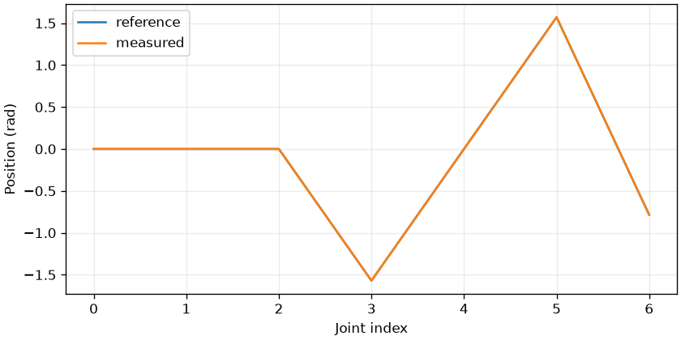

# core-04 — Unified viewer and deterministic rendering

<!-- pal:metadata:start -->
| Field | Value |
|---|---|
| Stage / track | `core / common` |
| Legacy alias | `T04` |
| Platforms | `macos-arm64, linux-x86_64` |
| Capabilities | `python-3.12, numpy, mujoco` |
| Prerequisites | `core-03` |
| Safety | `simulation` |
| Verification | `maintainer-checked` |
| Implementation | `implemented` |
<!-- pal:metadata:end -->

## Reader route

Read the Expected result first. Your task is to connect the measured values to the learning goal, then explain the calculation and the code that produced them.

[Terminal setup, resuming, opening results and camera controls](../READER_GUIDE.md)

## Learning goals

Render the actual FR3 scene and inspect the camera result.

## Preflight

On a fresh checkout, run `sh bootstrap.sh --plan`, read the plan, then use `--apply`. Activate `source .venv/bin/activate` before these commands. If the run directory already exists, use a new suffix such as 02.

Prepare the required public models once:

```bash
pal assets fetch mujoco-menagerie
```

```bash
pal host detect --json
pal lesson check core-04 --json
```

## Action

```bash
pal lesson run core-04 --headless --seed 7 --samples 64 --output-dir .local/runs/core-04/baseline-01 --json
```

## Expected

Measured development example. Read both axis units and the reference/measured difference first. Validate your own run separately.



Open frame.png, a 480×360 MuJoCo RGB rendering, and frame.pgm, its grayscale representation. Identify the base, elbow and tool. Repeated host-stable rendering should depict the same pose.

Common artifacts are summary.json, trace.csv, experiment.json, plot.png, run.json and lesson-report.md. Model lessons also produce frame.png or the external stack's evaluation/Isaac image. Inspect axes, units and camera framing, not only file size.

```bash
pal lesson check core-04 --run-dir .local/runs/core-04/baseline-01 --json
```

## Observe

Read the metric units, observed_first/observed_last and checks first. Inspection validates saved files, exits, and leaves completion unchanged.

```bash
pal lesson inspect core-04 --run-dir .local/runs/core-04/baseline-01 --json
```

Open the plot on macOS (closing the image preserves the run):

```bash
open .local/runs/core-04/baseline-01/plot.png
```

On other systems, open the same PNG in your file manager. Read the raw values from this JSON:

```bash
python -m json.tool .local/runs/core-04/baseline-01/experiment.json
```

## How it works

A model, state, camera and renderer jointly determine pixels. Headless means no interactive viewer; it still needs a functioning offscreen graphics context. Pixel variance rejects blank images but cannot establish a useful camera angle.

$$
I\in\{0,\ldots,255\}^{360\times480\times3}
$$

Symbols, units and assumptions: I: RGB uint8 image; axes: row, column, channel.

Worked calculation (not a measured run result): 360 × 480 × 3 = 518400 channel values.

Practical connection: A nonblank image still needs the tool and ground visible.

## Code connection

`examples/core-04/run.py` → `src/pai_lab/lessons/runner.py` → `src/pai_lab/lessons/physics.py`. The runner records the execution; the experiment module computes measurements from actual state. Match `experiment.json` payload fields to the corresponding calculations.

## Try it

Change only camera azimuth from 135° to 165°. Joint state and numeric metrics stay fixed while the viewpoint in frame.png changes.

```bash
pal lesson run core-04 --headless --samples 64 --output-dir .local/runs/core-04/comparison-01 --seed 7 --param camera_azimuth=165 --json
```

Change only the named parameter indicated above. Explain differences in measurements, shape and limits. If results are invariant, explain why; do not invent a performance improvement.

```bash
pal lesson compare core-04 --run-dir .local/runs/core-04/baseline-01 --comparison-run-dir .local/runs/core-04/comparison-01 --output-dir .local/comparisons/core-04/comparison-01 --json
```

<details>
<summary>Optional: what changes when the assumptions fail?</summary>

Choose one input in the equation and write its units. Inspect whether doubling it doubles the output or whether clipping, normalization or coordinate transforms change that relationship. Changing another assumption or model at the same time needs a separate experiment.

</details>

## Recovery

For capability-unavailable, prepare exactly the reported Python, model, platform or external stack, then rerun this lesson in a new directory. Preserve the failed run.json and numerical evidence. Do not automatically install system packages, drivers, CUDA, ROS, Isaac or large models. Resolve checksum errors by restoring a pinned cache, never by editing vendor sources.

## Checkpoint

Replace `--notes` with the concrete measurements and interpretation you observed before running this command. Save, fix and reverify received feedback first. Unresolved feedback, changed execution code or corrupt artifacts block completion. Execution alone does not complete the lesson. Stop after finishing this lesson.

```bash
pal lesson review core-04 --run-dir .local/runs/core-04/baseline-01 --comparison-run-dir .local/runs/core-04/comparison-01 --notes "Explained measured results and one-variable comparison; inspected plots and renderings." --json
pal lesson finish core-04 --run-dir .local/runs/core-04/baseline-01 --json
```

<!-- pal:navigation:start -->
## Next lesson

[core-fr3-01](./core-fr3-01.md)

This is catalog order. Use `pal course next --json` to select an eligible lesson.
<!-- pal:navigation:end -->
