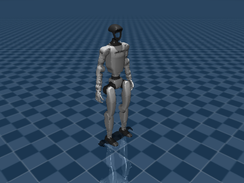

# core-g1-01 — Unitree G1 playback and motion data

<!-- pal:metadata:start -->
| Field | Value |
|---|---|
| Stage / track | `core / g1` |
| Legacy alias | `T25` |
| Platforms | `macos-arm64, linux-x86_64` |
| Capabilities | `python-3.12, numpy, mujoco` |
| Prerequisites | `core-03, core-04` |
| Safety | `simulation` |
| Verification | `maintainer-checked` |
| Implementation | `implemented` |
<!-- pal:metadata:end -->

## Learning goals

Record and replay a bounded G1 joint-motion cycle.

## Preflight

On a fresh checkout, run `sh bootstrap.sh --plan`, read the plan, then use `--apply`. Activate `source .venv/bin/activate` before these commands. If the run directory already exists, use a new suffix such as 02.

Prepare the required public models once:

```bash
pal assets fetch mujoco-menagerie
```

```bash
pal host detect --json
pal lesson check core-g1-01 --json
```

## Action

```bash
pal lesson run core-g1-01 --headless --seed 7 --samples 64 --output-dir .local/runs/core-g1-01/baseline-01 --json
```

## Expected

Reviewed maintainer example from the pinned public model; your local run must be checked separately.



Inspect joint_names, motion.npz, loop closure and exact replay error. variant 1.5 changes hinge amplitude from 0.08 to 0.12 rad.

Common artifacts are summary.json, trace.csv, experiment.json, plot.png, run.json and lesson-report.md. Model lessons also produce frame.png or the external stack's evaluation/Isaac image. Inspect axes, units and camera framing, not only file size.

```bash
pal lesson check core-g1-01 --run-dir .local/runs/core-g1-01/baseline-01 --json
```

## How it works

The public G1 model includes a floating base, so qpos includes a quaternion. Only hinge-joint addresses are varied; replay writes the full saved configuration and evaluates forward kinematics. This is prescribed playback, not learned walking.

```text
q_hinge(t) = q_home + A sin(phase)
```

## Code connection

`examples/core-g1-01/run.py` → `src/pai_lab/lessons/runner.py` → `src/pai_lab/lessons/hands.py`. The runner records the execution; the experiment module computes measurements from actual state. Match `experiment.json` payload fields to the corresponding calculations.

## Try it

Hinge motion amplitude: 0.08 → 0.12 rad, clipped to each model limit. The floating-base quaternion is preserved.

```bash
pal lesson run core-g1-01 --headless --seed 7 --samples 64 --output-dir .local/runs/core-g1-01/comparison-01 --variant 1.5 --json
```

Change only the indicated seed, sample count or variant. Explain differences in measurements, shape and limits. If results are invariant, explain why; do not invent a performance improvement.

## Recovery

For capability-unavailable, prepare exactly the reported Python, model, platform or external stack, then rerun this lesson in a new directory. Preserve the failed run.json and numerical evidence. Do not automatically install system packages, drivers, CUDA, ROS, Isaac or large models. Resolve checksum errors by restoring a pinned cache, never by editing vendor sources.

## Checkpoint

Replace `--notes` with the concrete measurements and interpretation you observed before running this command. Save, fix and reverify received feedback first. Unresolved feedback, changed execution code or corrupt artifacts block completion. Execution alone does not complete the lesson. Stop after finishing this lesson.

```bash
pal lesson review core-g1-01 --run-dir .local/runs/core-g1-01/baseline-01 --comparison-run-dir .local/runs/core-g1-01/comparison-01 --notes "Explained measured results and one-variable comparison; inspected plots and renderings." --json
pal lesson finish core-g1-01 --run-dir .local/runs/core-g1-01/baseline-01 --json
```

<!-- pal:navigation:start -->
## Next lesson

[core-il-01](./core-il-01.md)

This is catalog order. Use `pal course next --json` to select an eligible lesson.
<!-- pal:navigation:end -->
