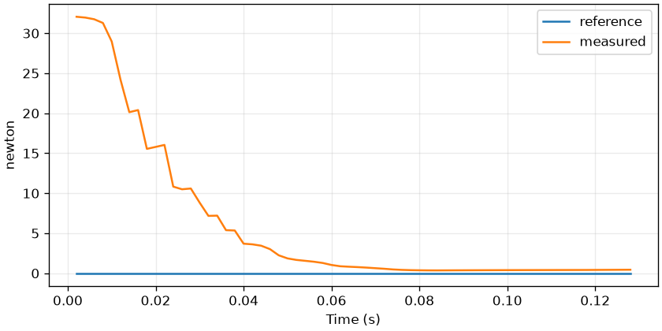
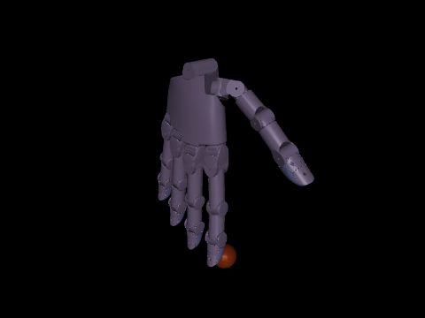

# core-wuji-02 — Wuji virtual tactile observation

<!-- pal:metadata:start -->
| Field | Value |
|---|---|
| Stage / track | `core / wuji` |
| Legacy alias | `T15` |
| Platforms | `macos-arm64, linux-x86_64` |
| Capabilities | `python-3.12, numpy, mujoco` |
| Prerequisites | `core-wuji-01` |
| Safety | `simulation` |
| Verification | `maintainer-checked` |
| Implementation | `implemented` |
<!-- pal:metadata:end -->

## Reader route

Read the Expected result first. Your task is to connect the measured values to the learning goal, then explain the calculation and the code that produced them.

[Terminal setup, resuming, opening results and camera controls](../READER_GUIDE.md)

## Learning goals

Read virtual contact forces at a Wuji fingertip.

## Preflight

On a fresh checkout, run `sh bootstrap.sh --plan`, read the plan, then use `--apply`. Activate `source .venv/bin/activate` before these commands. If the run directory already exists, use a new suffix such as 02.

Prepare the required public models once:

```bash
pal assets fetch wuji-description-beta2
```

```bash
pal host detect --json
pal lesson check core-wuji-02 --json
```

## Action

```bash
pal lesson run core-wuji-02 --headless --seed 7 --samples 64 --output-dir .local/runs/core-wuji-02/baseline-01 --json
```

## Expected

Measured development example. Read both axis units and the reference/measured difference first. Validate your own run separately.



Reviewed maintainer example from the pinned public model; your local run must be checked separately.



Inspect stimulus contacts and positive force values in tactile-grid.csv and experiment.json. variant 1.5 changes stimulus radius from 12 to 18 mm.

Common artifacts are summary.json, trace.csv, experiment.json, plot.png, run.json and lesson-report.md. Model lessons also produce frame.png or the external stack's evaluation/Isaac image. Inspect axes, units and camera framing, not only file size.

```bash
pal lesson check core-wuji-02 --run-dir .local/runs/core-wuji-02/baseline-01 --json
```

## Observe

Read the metric units, observed_first/observed_last and checks first. Inspection validates saved files, exits, and leaves completion unchanged.

```bash
pal lesson inspect core-wuji-02 --run-dir .local/runs/core-wuji-02/baseline-01 --json
```

Open the plot on macOS (closing the image preserves the run):

```bash
open .local/runs/core-wuji-02/baseline-01/plot.png
```

On other systems, open the same PNG in your file manager. Read the raw values from this JSON:

```bash
python -m json.tool .local/runs/core-wuji-02/baseline-01/experiment.json
```

## How it works

A local spherical stimulus contacts the hand's actual collision geometry. The observation records contact positions and contact-frame forces. It does not emulate a calibrated tactile sensor's pixel grid or electrical response.

$$
\bar f_n=\frac1N\sum_{i=1}^{N}f_{n,i}
$$

Symbols, units and assumptions: fn: contact-frame N; N: number of sampled contacts.

Worked calculation (not a measured run result): contacts 2 N and 4 N → mean 3 N.

Practical connection: A collision contact is not a calibrated tactile taxel reading.

## Code connection

`examples/core-wuji-02/run.py` → `src/pai_lab/lessons/runner.py` → `src/pai_lab/lessons/hands.py`. The runner records the execution; the experiment module computes measurements from actual state. Match `experiment.json` payload fields to the corresponding calculations.

## Try it

Virtual probe radius: 0.012 → 0.018 m. Contact geometry changes, so compare contact count and measured force together.

```bash
pal lesson run core-wuji-02 --headless --seed 7 --samples 64 --output-dir .local/runs/core-wuji-02/comparison-01 --variant 1.5 --json
```

Change only the indicated seed, sample count or variant. Explain differences in measurements, shape and limits. If results are invariant, explain why; do not invent a performance improvement.

```bash
pal lesson compare core-wuji-02 --run-dir .local/runs/core-wuji-02/baseline-01 --comparison-run-dir .local/runs/core-wuji-02/comparison-01 --output-dir .local/comparisons/core-wuji-02/comparison-01 --json
```

<details>
<summary>Optional: what changes when the assumptions fail?</summary>

Choose one input in the equation and write its units. Inspect whether doubling it doubles the output or whether clipping, normalization or coordinate transforms change that relationship. Changing another assumption or model at the same time needs a separate experiment.

</details>

## Recovery

For capability-unavailable, prepare exactly the reported Python, model, platform or external stack, then rerun this lesson in a new directory. Preserve the failed run.json and numerical evidence. Do not automatically install system packages, drivers, CUDA, ROS, Isaac or large models. Resolve checksum errors by restoring a pinned cache, never by editing vendor sources.

## Checkpoint

Replace `--notes` with the concrete measurements and interpretation you observed before running this command. Save, fix and reverify received feedback first. Unresolved feedback, changed execution code or corrupt artifacts block completion. Execution alone does not complete the lesson. Stop after finishing this lesson.

```bash
pal lesson review core-wuji-02 --run-dir .local/runs/core-wuji-02/baseline-01 --comparison-run-dir .local/runs/core-wuji-02/comparison-01 --notes "Explained measured results and one-variable comparison; inspected plots and renderings." --json
pal lesson finish core-wuji-02 --run-dir .local/runs/core-wuji-02/baseline-01 --json
```

<!-- pal:navigation:start -->
## Next lesson

[core-dexterity-01](./core-dexterity-01.md)

This is catalog order. Use `pal course next --json` to select an eligible lesson.
<!-- pal:navigation:end -->
