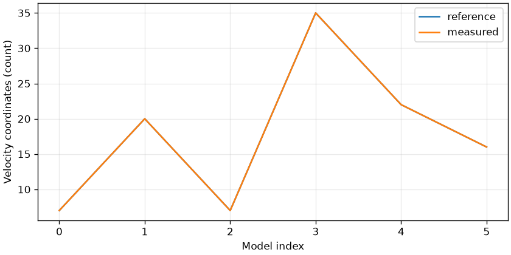

# core-03 — 다중 모델 검사와 자산 검증

<!-- pal:metadata:start -->
| Field | Value |
|---|---|
| Stage / track | `core / common` |
| Legacy alias | `T03` |
| Platforms | `macos-arm64, linux-x86_64` |
| Capabilities | `python-3.12, numpy, mujoco` |
| Prerequisites | `core-01, core-02` |
| Safety | `simulation` |
| Verification | `maintainer-checked` |
| Implementation | `implemented` |
<!-- pal:metadata:end -->

## Reader route

이 수업의 질문은 아래 목표를 실행 결과의 값과 연결해 설명할 수 있는가입니다. 먼저 Expected의 결과 기준을 읽고 실행한 뒤, 관찰·계산·코드를 순서대로 확인합니다.

[터미널 준비·재개·결과 열기·카메라 조작](../READER_GUIDE.md)

## Learning goals

여섯 로봇 모델을 로드하고 실제 차원을 검사합니다.

## Preflight

처음이면 저장소 루트에서 `sh bootstrap.sh --plan`을 실행하고 계획을 읽은 뒤 `--apply`로 환경을 준비합니다. `source .venv/bin/activate` 후 아래 명령을 사용합니다. 이미 같은 이름의 실행 폴더가 있으면 02처럼 새 이름을 정합니다.

필요한 공개 모델을 한 번 준비합니다:

```bash
pal assets fetch mujoco-menagerie
pal assets fetch wuji-description-beta2
pal assets fetch flexiv-description
```

```bash
pal host detect --json
pal lesson check core-03 --json
```

## Action

```bash
pal lesson run core-03 --headless --seed 7 --samples 64 --output-dir .local/runs/core-03/baseline-01 --json
```

## Expected

실제 개발 실행의 예시입니다. 가로축·세로축의 단위와 기준/측정 곡선의 차이를 먼저 읽습니다. 개인 실행 결과는 별도 검사합니다.



FR3·Enlight·Wuji·Sharpa·G1·ALOHA의 관절 이름, 한계, 총질량, nq/nv/nu를 읽습니다. Enlight 로컬 초안은 고정된 vendor 파라미터로 생성됩니다.

공통 산출물은 summary.json, trace.csv, experiment.json, plot.png, run.json과 lesson-report.md입니다. 모델 수업에는 실제 frame.png 또는 외부 스택의 evaluation/isaac 이미지도 있습니다. 파일 크기만 보지 말고 그래프 축·단위·영상 구도를 직접 확인합니다.

```bash
pal lesson check core-03 --run-dir .local/runs/core-03/baseline-01 --json
```

## Observe

먼저 metric의 단위, observed_first/observed_last, checks를 읽습니다. inspection은 검증된 파일만 읽고 종료하며 진도를 완료하지 않습니다.

```bash
pal lesson inspect core-03 --run-dir .local/runs/core-03/baseline-01 --json
```

Mac 결과 그래프 열기(창을 닫아도 실행 기록은 유지됩니다):

```bash
open .local/runs/core-03/baseline-01/plot.png
```

다른 OS의 파일 관리자에서는 같은 PNG를 엽니다. 원시 수치는 아래 JSON에 있습니다.

```bash
python -m json.tool .local/runs/core-03/baseline-01/experiment.json
```

## How it works

nq는 위치 좌표 수, nv는 속도 좌표 수입니다. 자유 관절은 위치 좌표 7개와 속도 좌표 6개를 갖습니다. nu는 구동기 수이므로 nq나 nv와 같을 필요가 없습니다.

$$
n_q=7,\quad n_v=6\quad\text{(one free joint)}
$$

기호·단위·조건: 개수는 무차원; quaternion의 크기는 1.

손으로 계산하는 예시(실행 측정값이 아님): 3 position + 4 quaternion = 7; 3 linear + 3 angular = 6.

실전 연결: 위치 주소를 속도 배열 인덱스로 쓰면 안 됩니다.

## Code connection

`examples/core-03/run.py` → `src/pai_lab/lessons/runner.py` → `src/pai_lab/lessons/physics.py`. runner는 실행을 기록하고 실험 모듈이 실제 상태에서 수치를 계산합니다. `experiment.json`의 payload를 계산 코드와 대조합니다.

## Try it

이 수업은 구조·환경 조사입니다. seed를 바꾼 수치 실험을 요구하지 않습니다. 이름·단위·선수 조건과 실제 artifact를 대조하고, 발견한 항목을 review notes에 적습니다.

<details>
<summary>선택 심화: 가정이 깨지면 무엇이 달라질까요?</summary>

본문 식의 입력 하나를 고르고 단위를 적습니다. 그 값이 두 배일 때 출력이 두 배인지, 포화·정규화·좌표 변환 때문에 다른지 코드에서 확인합니다. 다른 가정이나 모델까지 동시에 바꾸면 한 변수 비교가 아니므로 별도 실행으로 기록합니다.

</details>

## Recovery

capability-unavailable이면 missing 목록에 나온 Python·모델·플랫폼·외부 스택을 준비한 뒤 같은 수업을 새 폴더에서 재실행합니다. 실패한 run.json과 수치를 보존합니다. 시스템 패키지·드라이버·CUDA·ROS·Isaac·대형 모델은 자동 설치하지 않습니다. 체크섬 오류는 vendor 소스를 수정하지 말고 고정 캐시를 복구합니다.

## Checkpoint

명령을 그대로 복사하기 전에 `--notes`를 자신이 관찰한 구체적인 수치와 해석으로 바꿉니다. 접수된 [개선점]을 먼저 저장·수정·재검증합니다. 미해결 개선점, 변경된 실행 코드, 손상된 산출물은 완료를 막습니다. 실행만으로 진도가 완료되지 않습니다. 완료 후 여기서 멈춥니다.

```bash
pal lesson review core-03 --run-dir .local/runs/core-03/baseline-01 --notes "측정 결과와 한 변수 비교를 설명하고 그래프와 렌더링을 확인했습니다." --json
pal lesson finish core-03 --run-dir .local/runs/core-03/baseline-01 --json
```

<!-- pal:navigation:start -->
## Next lesson

[core-04](./core-04.md)

다음 항목은 목차 순서입니다. 실제 선택은 `pal course next --json`이 준비 상태로 결정합니다.
<!-- pal:navigation:end -->
