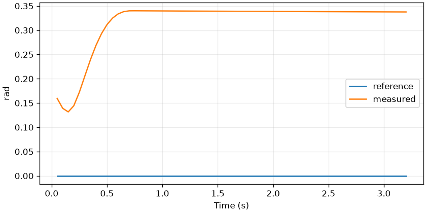

# core-fr3-02 — FR3 관절 공간 PD 제어

<!-- pal:metadata:start -->
| Field | Value |
|---|---|
| Stage / track | `core / fr3` |
| Legacy alias | `T06` |
| Platforms | `macos-arm64, linux-x86_64` |
| Capabilities | `python-3.12, numpy, mujoco` |
| Prerequisites | `core-fr3-01` |
| Safety | `simulation` |
| Verification | `maintainer-checked` |
| Implementation | `implemented` |
<!-- pal:metadata:end -->

## Reader route

이 수업의 질문은 아래 목표를 실행 결과의 값과 연결해 설명할 수 있는가입니다. 먼저 Expected의 결과 기준을 읽고 실행한 뒤, 관찰·계산·코드를 순서대로 확인합니다.

[터미널 준비·재개·결과 열기·카메라 조작](../READER_GUIDE.md)

## Learning goals

FR3 동역학에 제한된 관절 PD 토크를 적용합니다.

## Preflight

처음이면 저장소 루트에서 `sh bootstrap.sh --plan`을 실행하고 계획을 읽은 뒤 `--apply`로 환경을 준비합니다. `source .venv/bin/activate` 후 아래 명령을 사용합니다. 이미 같은 이름의 실행 폴더가 있으면 02처럼 새 이름을 정합니다.

필요한 공개 모델을 한 번 준비합니다:

```bash
pal assets fetch mujoco-menagerie
```

```bash
pal host detect --json
pal lesson check core-fr3-02 --json
```

## Action

```bash
pal lesson run core-fr3-02 --headless --seed 7 --samples 64 --output-dir .local/runs/core-fr3-02/baseline-01 --json
```

## Expected

고정된 공개 모델로 실행해 검토한 예시입니다. 개인 실행 결과는 별도로 검사합니다.



첫 관절 목표를 0.18 rad 이동합니다. 첫 관절 오차는 0.02 rad 미만, 전체 팔 오차는 0.5 rad 미만이어야 합니다. 토크 포화와 중력에 의한 잔여 오차를 살펴봅니다.

공통 산출물은 summary.json, trace.csv, experiment.json, plot.png, run.json과 lesson-report.md입니다. 모델 수업에는 실제 frame.png 또는 외부 스택의 evaluation/isaac 이미지도 있습니다. 파일 크기만 보지 말고 그래프 축·단위·영상 구도를 직접 확인합니다.

```bash
pal lesson check core-fr3-02 --run-dir .local/runs/core-fr3-02/baseline-01 --json
```

## Observe

먼저 metric의 단위, observed_first/observed_last, checks를 읽습니다. inspection은 검증된 파일만 읽고 종료하며 진도를 완료하지 않습니다.

```bash
pal lesson inspect core-fr3-02 --run-dir .local/runs/core-fr3-02/baseline-01 --json
```

Mac 결과 그래프 열기(창을 닫아도 실행 기록은 유지됩니다):

```bash
open .local/runs/core-fr3-02/baseline-01/plot.png
```

다른 OS의 파일 관리자에서는 같은 PNG를 엽니다. 원시 수치는 아래 JSON에 있습니다.

```bash
python -m json.tool .local/runs/core-fr3-02/baseline-01/experiment.json
```

## How it works

비례 토크는 위치 오차를 줄이고 미분 토크는 속도를 감쇠합니다. 여기서는 kp=120 Nm/rad, kd=2√kp Nms/rad입니다. 중력 보상 없이 정상상태 오차가 남으므로 지령을 준 첫 관절과 전체 팔 오차를 구분합니다.

$$
\tau_{raw}=K_p(q^*-q)-K_d\dot q,\qquad\tau=\operatorname{clip}(\tau_{raw},\tau_{min},\tau_{max})
$$

기호·단위·조건: q,q*: rad; qdot: rad/s; Kp: Nm/rad; Kd: Nm s/rad; 토크: Nm.

손으로 계산하는 예시(실행 측정값이 아님): 120 × 0.18 − 21.9089 × 0 = 21.6 Nm.

실전 연결: 하중의 중력은 잔여 오차를 만들며, 포화되면 이득 증가 효과도 제한됩니다.

## Code connection

`examples/core-fr3-02/run.py` → `src/pai_lab/lessons/runner.py` → `src/pai_lab/lessons/physics.py`. runner는 실행을 기록하고 실험 모듈이 실제 상태에서 수치를 계산합니다. `experiment.json`의 payload를 계산 코드와 대조합니다.

`arm_control`은 입력 목표를 만든 뒤 `gain * (target_q - data.qpos) - kd * data.qvel`을 계산합니다. `np.clip`으로 모델의 토크 범위를 적용해 `qfrc_applied`에 씁니다. 이 경로에서는 모델 actuator를 비활성화하므로 이 토크가 이중 적용되지 않습니다. `control.csv`는 mj_step **직전**의 시각·관절·목표·현재 위치·속도·토크를 저장합니다. `mj_step` 25회 뒤 `mj_forward`로 관측 위치를 갱신하고 전체 오차를 trace.csv에 기록합니다. 첫 번째 행의 21.6 Nm 계산을 직접 재현한 뒤 포화된 행을 찾으세요.

감쇠 규칙의 숫자 `2√kp`는 기준 관성 1 kg m²를 가정한 교육용 수치 규칙입니다. 일반 1자유도 임계 감쇠식은 $K_d=2\sqrt{I K_p}$이며, 실제 다관절 팔은 결합 관성과 하중 때문에 관절마다 임계 감쇠가 달라집니다.

## Try it

`kp`만 120 → 180 Nm/rad로 바꿉니다. `kd`는 21.9089 Nm s/rad로 유지합니다. 기존 `--variant 1.5`는 kp와 kd=2√kp 규칙을 함께 바꾸는 별도 실험입니다.

```bash
pal lesson run core-fr3-02 --headless --seed 7 --samples 64 --output-dir .local/runs/core-fr3-02/comparison-01 --param kp=180 --json
```

위 명령에서 지정한 이름 있는 파라미터 한 값만 바꿉니다. 기본 결과와 비교 결과의 수치·형상·한계를 설명합니다. 차이가 없으면 해당 변수가 이 실험에서 불변인 이유를 설명하고 성능 개선으로 꾸미지 않습니다.

```bash
pal lesson compare core-fr3-02 --run-dir .local/runs/core-fr3-02/baseline-01 --comparison-run-dir .local/runs/core-fr3-02/comparison-01 --output-dir .local/comparisons/core-fr3-02/comparison-01 --json
```

<details>
<summary>선택 심화: 가정이 깨지면 무엇이 달라질까요?</summary>

본문 식의 입력 하나를 고르고 단위를 적습니다. 그 값이 두 배일 때 출력이 두 배인지, 포화·정규화·좌표 변환 때문에 다른지 코드에서 확인합니다. 다른 가정이나 모델까지 동시에 바꾸면 한 변수 비교가 아니므로 별도 실행으로 기록합니다.

</details>

## Recovery

capability-unavailable이면 missing 목록에 나온 Python·모델·플랫폼·외부 스택을 준비한 뒤 같은 수업을 새 폴더에서 재실행합니다. 실패한 run.json과 수치를 보존합니다. 시스템 패키지·드라이버·CUDA·ROS·Isaac·대형 모델은 자동 설치하지 않습니다. 체크섬 오류는 vendor 소스를 수정하지 말고 고정 캐시를 복구합니다.

## Checkpoint

명령을 그대로 복사하기 전에 `--notes`를 자신이 관찰한 구체적인 수치와 해석으로 바꿉니다. 접수된 [개선점]을 먼저 저장·수정·재검증합니다. 미해결 개선점, 변경된 실행 코드, 손상된 산출물은 완료를 막습니다. 실행만으로 진도가 완료되지 않습니다. 완료 후 여기서 멈춥니다.

```bash
pal lesson review core-fr3-02 --run-dir .local/runs/core-fr3-02/baseline-01 --comparison-run-dir .local/runs/core-fr3-02/comparison-01 --notes "측정 결과와 한 변수 비교를 설명하고 그래프와 렌더링을 확인했습니다." --json
pal lesson finish core-fr3-02 --run-dir .local/runs/core-fr3-02/baseline-01 --json
```

<!-- pal:navigation:start -->
## Next lesson

[core-fr3-03](./core-fr3-03.md)

다음 항목은 목차 순서입니다. 실제 선택은 `pal course next --json`이 준비 상태로 결정합니다.
<!-- pal:navigation:end -->
